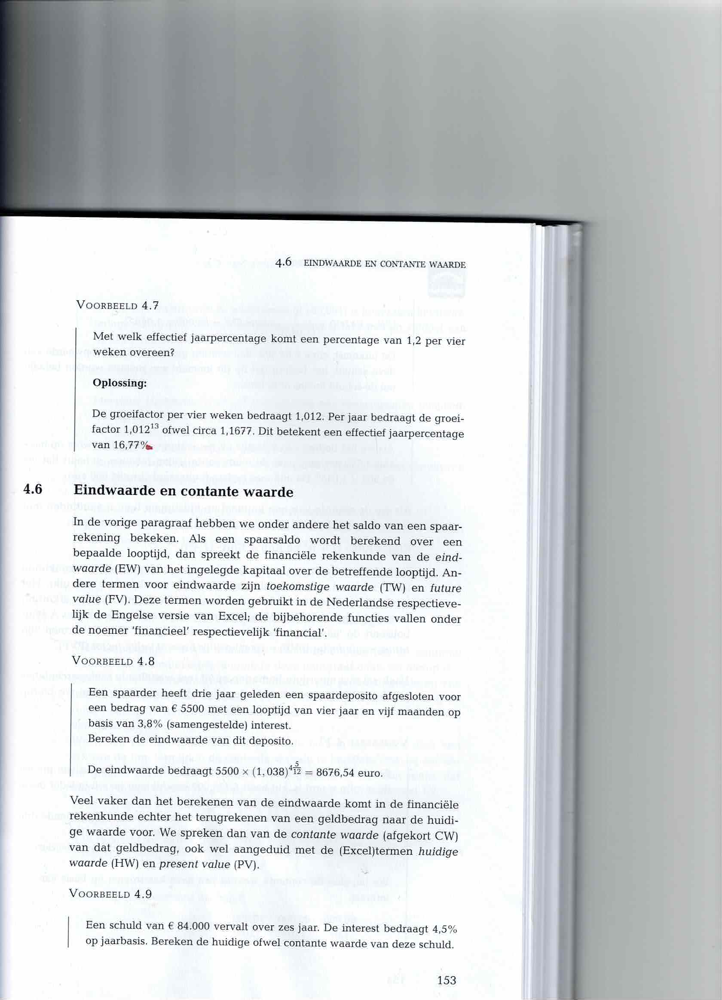

# FsFinancieelExpert

Voorbeelden van financiële berekeningen in een F# ("Fs") Windows Forms applicatie. NB: De applicatie is nog in een ALPHA-status, en zal/moet verder ontwikkeld worden. Op dot moement (9 oktober 2025) kan schrijver dezes (Alex Schutzelaars) er niet voor instaan dat alle berekende waarden correct zijn.
Er is ook een klein C#-projectje met een voorbeeld berekening van de toekomsytige waarde van een hoofdsom en en periodike inleg. En er is een Racker module die de zelfde functionaliteit biedt (met GUI-schil) als het scherm voor de eindwaarde -berekening in het F#-project.
En er is ook een Racket-programma met een GUI-schil dat dezelfde functionaliteit biedt als het scherm voor de eindwaarde -berekening in het F#-project.

## Beschrijving

Eenvoudige financiële berekeningen (bijvoorbeeld: spaarplannen) kunnen in een F# Windows Forms applicatie uitgevoerd worden.

- Hoofdscherm, met koppelingen (via knoppen) naar:
- Effectenportefeuille: berekening van de waarden van beleggingsfondsen (aandelen/obligaties). De data komen uit een XML-bestand.
- Berekeningen van toekomstige waarde op basis van een startkapitaal (eventueel aangevuld met een periodieke inleg), rentepercentage en looptijd (aantal jaren).
- Berekeningen van contante waarde op basis van een doelwaarde in de toekomst, rentepercentage en looptijd (aantal jaren)

De rekenfuncties voor de laatste formules zijn respectievelijk gebaseerd op de Excel-functies TW en HW (de rekenmethoden hebben dezelfde parameters, in dezelfde volgorde, als hun Excel tegenhangers) .
Zij moeten dan ook dezelfde resultaten (afgezien van wat extra decimalen/afronding) opleveren als de functies in Excel, natuurlijk bij gelijke invoer.

## Hoe te beginnen?

### Afhankelijkheden
- Zorg ervoor dat .NET 9.0 (of later) is geïnstalleerd op de PC waarop je het programma wilt bouwen (build van de applicatiecode in .NET, vanaf Windows 10.)
Ove hoe je dat doet, zie: https://dotnet.microsoft.com/en-us/download/dotnet/9.0

### Installatie
- Zet de code in een nieuwe map. (ZIP die map vanaf deze GitHub repository, en pak die uit in bijvoorbeeld een nieuwe map, bijvoorbeeld: "C:/Projecten"s.)
- Build het programma in PowerShell (Windows-toets+R: type "powershell"), vanaf het hoogste niveau van de aangemaakte map). Dat doe je met:
    #### dotnet build --configuration Release
    of:
    #### dotnet publish -c Release -r win-x64 --self-contained true
De tweede optie ("PUBLISH"), eveneens met een standalone executable, maakt een grotere map aan dan de eerste optie. Voordeel van deze optie: je hebt geen .NET runtime meer nodig op de PC waarop je het programma wilt draaien.
- Zoek het uitvoerbare bestand: FsFinancieelExpert.exe in de map. Bijvoorbeeld: C:\Projecten\FsFinancieelExpert\bin\Release\net9.0-windows\FsFinancieelExpert2\.exe
- Optioneel: Maak een snelkoppeling naar het uitvoerbare bestand op je bureaublad.

### Uitvoeren van het programma

- Draai FsFinancieelExpert.exe vanaf PowerShell of de CMD. Bijvoorbeeld in: C:\Projecten\FsFinancieelExpert\bin\Release\net9.0-windows\FsFinancieelExpert.exe

## Help

Hier is wat uitleg over de functionaliteit. (De applicatie is nog in ontwikkeling, dus de functies zijn nog wat rudimentair.)
### Hoofdscherm: selecteer een van de knoppen om naar het scherm met de genoemde functie te gaan.
Effectenportefeuille: laad een XML-bestand met gegevens over effecten (aandelen, obligaties, etc.).
Het bestand vooronderstelt een bepaalde structuur. Als je een fonds selecteert, wordt de waarde van dat fonds (aantal stukken MAAL koers) getoond.
Een voorbeeldbestand is aanwezig in de map "VoorbeeldBestanden". De gegevens worden getoond in een tabel.
(Nog te ontwikkelen: berekening van totalen en rendementen.)
(Als je een ander XML-bestand wilt gebruiken, zorg er dan voor dat het dezelfde structuur heeft als het voorbeeldbestand. Je kunt het voorbeeldbestand aanpassen met je eigen gegevens, of een nieuw bestand maken met dezelfde structuur. Zet het wel in een andere map (is netter),

Toekomstige waarde: voer de gegevens in (huidige waarde, rentepercentage, aantal jaren), en klik op "Bereken".
De toekomstige waarde wordt getoond. (Je kunt ook de knop "Voorbeeldgegevens" gebruiken om voorbeeldgegevens in te vullen.) Je kunt kiezen:
- of je periodiek wilt inleggen (en zo ja, hoeveel per periode).
- of de inleg aan het begin of aan het einde van de periode plaatsvindt (respectievelijk pre- en postnumerando).
- of de rente jaarlijks, halfjaarlijks, per kwartaal, maandelijks of dagelijks wordt berekend.

- Voorbeeld zie de afbeelding hieronder (uit Basisboek Wiskunde en financiële rekenkunde, p.153) voor een concrete eindwaarde-berekening:

Contante waarde: voer de gegevens in (toekomstige waarde (= doelwaarde in de toekomst), rentepercentage, aantal jaren), en klik op "Bereken". De contante waarde wordt getoond. Je kunt ook de knop "Voorbeeldgegevens" gebruiken om voorbeeldgegevens in te vullen.  

Tenslotte is er een Documentatie-knop die deze readme.md opent (en als *rich text* toont) in de standaard webbrowser.
## Auteurs

Alex Schutzelaars (a.schutzelaars@outlook.com)

## Versiegeschiedenis
* 0.3
(Deze versie is nog te ontwikkelen: in voorbereiding.)
   * Verbetering layout van schermen (scherm voor contante waarde is onvolledig)
    Effectenportefeuille: berekenen van totalen, en rendement (1-jarig, 5-jarig)
   * refactoring
   * verbeteren van de berekeningen, indien nodig (zie unit tests)
   * voor contante waarde: het scherm uitbreiden
   * toevoegen van een unit test project (om de financiële berekeningen - in diverse scenario's -  te testen))
   * Wellicht omzetten in een XAML-applicatie, en/of een webversie.
   * Nog op te lossen (alleen in de PUBLISH-versie van de release): het programma kan het bestand README.md niet vinden (Documentatie-knop).
   * Ontwikkeling eindwaarde weergeven in grafiek
* 0.2
    * 0.2.3: toevoegen van een C# Console project (om de financiële berekeningen - in diverse scenario's -  te testen))
    * 0.2.2: verbeteren van de berekeningen (met uitbreiding voor continue rente-bijschrijving)
    * 0.2.1: Prototype toegevoegd van een Racket programmma voor eindewaarde-berekeningen.
    * Zie [commit change]() or See [release history]()
* 0.1
    * Eerste versie

## Licentie/License

This project is licensed under the [Creative Commons Legal Code] License - see the LICENSE.md file for details

## Acknowledgments
Hulp van CoPilot.
